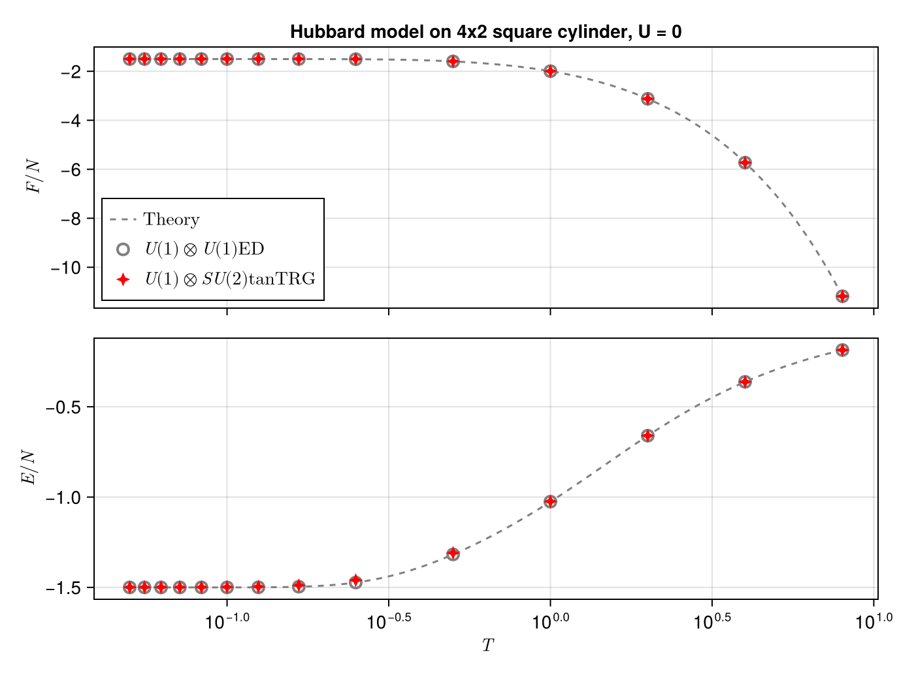
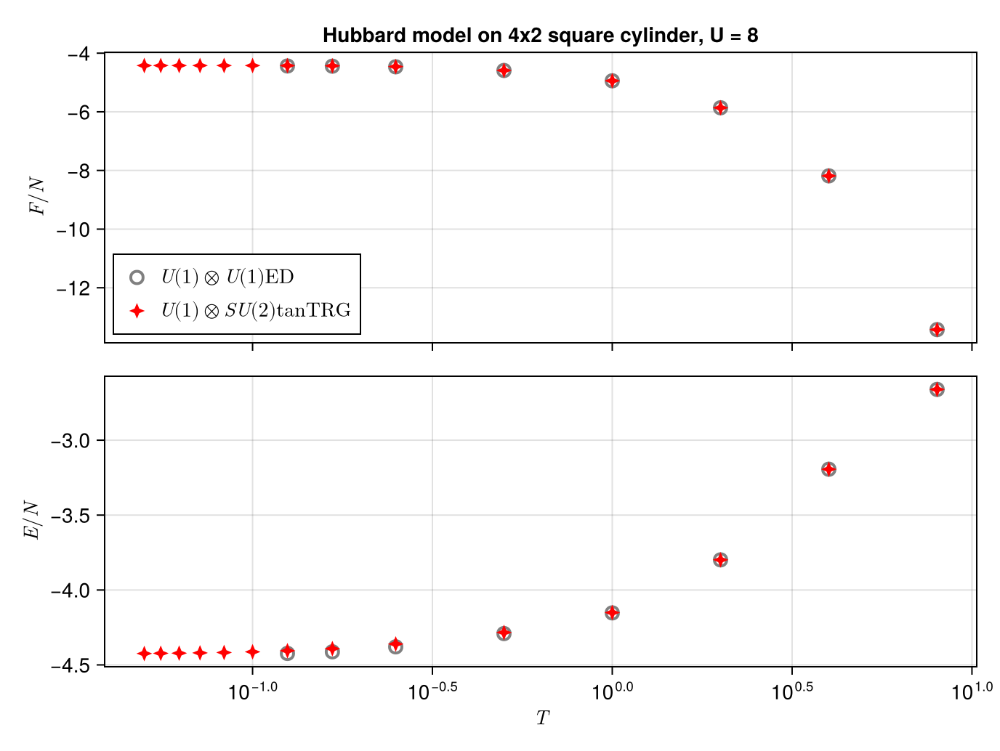
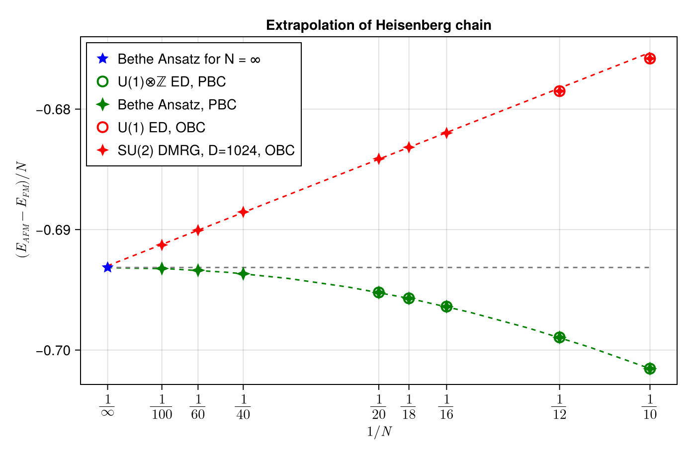

# iMPS.jl

Personal code for finite MPS simulations.

## Features

### Versatility

Now this code contains:

1. Density matrix renormalization group ([DMRG](https://en.wikipedia.org/wiki/Density_matrix_renormalization_group)) for calculating groundstates.
2. Time-dependent variational principle ([TDVP](https://link.aps.org/doi/10.1103/PhysRevB.94.165116)) for real and imaginary time evolution, which serves for dynamics (i.e., spectrum function and structure factor) and finite temperature simulations (i.e., tangent space tensor renormalization group, [tanTRG](https://link.aps.org/doi/10.1103/PhysRevLett.130.226502)), respectively.
3. Series-expansion thermal tensor network ([SETTN](https://link.aps.org/doi/10.1103/PhysRevB.95.161104)) for finite temperature simulations.
4. Controlled Bond Expansion ([CBE](https://doi.org/10.1103/PhysRevLett.130.246402)): algorithm for single site DMRG/TDVP to change local quantum numebr self-consistently, which effectively reduce the time and memory consumed.

### Examples

This code has been applied to many models in 1D and 2D finite lattice (square lattice mostly), including:

* Hubbard model: finite temperature calculation at half filled, compared with [ED](https://github.com/KunyangDU/iED.jl.git)

calculated with $U=0$ (free fermion) to check code precision and performance:

Detailed performance are listed below:
|N	| $L_x \times L_y$ | D | Error | CPU time per sweep (s)|
|------|--------- | ----------|--------------------|-----------|
|8 | 2x4 | 128 | 1E-14 | 2.02 | 
|16 | 4x4 | 1024 | 1E-07 | 87.2 | 
|24 | 6x4 | 2048 | 1E-07 | 300 | 
|32 | 8x4 | 2048 | 1E-06 | 542 | 
|40 | 10x4 | 2048 | 1E-06 | 681 | 
|48 | 12x4 | 2048 | 1E-05 | 726 | 
|12 | 2x6 | 512 | 1E-05 | 12.7 | 
|24 | 4x6 | 4096 | 1E-05 | 802 | 
|36 | 6x6 | 4096 | 1E-03 | 1806 | 
|48 | 8x6 | 4096 | 1E-03 | 3049 | 

* Heisenberg chain: the extrapolation of finite size Heisenberg chain. The limit of $N\to \infty$ for $(E_{AFM} - E_{FM})/N$ is given by [Bethe Ansatz](https://github.com/KunyangDU/Bethe-Ansatz.git): $-\ln 2$.

* Free fermion chain: calculation with a given bond dimension and different system size (length $L$). The tiume/memory complexity $\sim L$:

* The tutorial is to be added.

### Announcement

Some algorithms in this code is developed by [ CQM2 group](https://www.cqm2itp.com/) which works on purification-based finite-temperature simulations. Relevant packages are listed below:

* [FiniteMPS.jl](https://github.com/Qiaoyi-Li/FiniteMPS.jl)

## TODO

* Some local tensor can be redefined to improve the memory performance.

## Acknowledgments

The following packages has been used:

* [TensorKit.jl](https://github.com/Jutho/TensorKit.jl) for basic tensor operations.
* [MKL.jl](https://github.com/JuliaLinearAlgebra/MKL.jl) for nested multi-threaded BLAS.
* [AbstractTrees.jl](https://github.com/JuliaCollections/AbstractTrees.jl.git) for tree struct to generate automata, which constructs Hamiltonian automatically.

